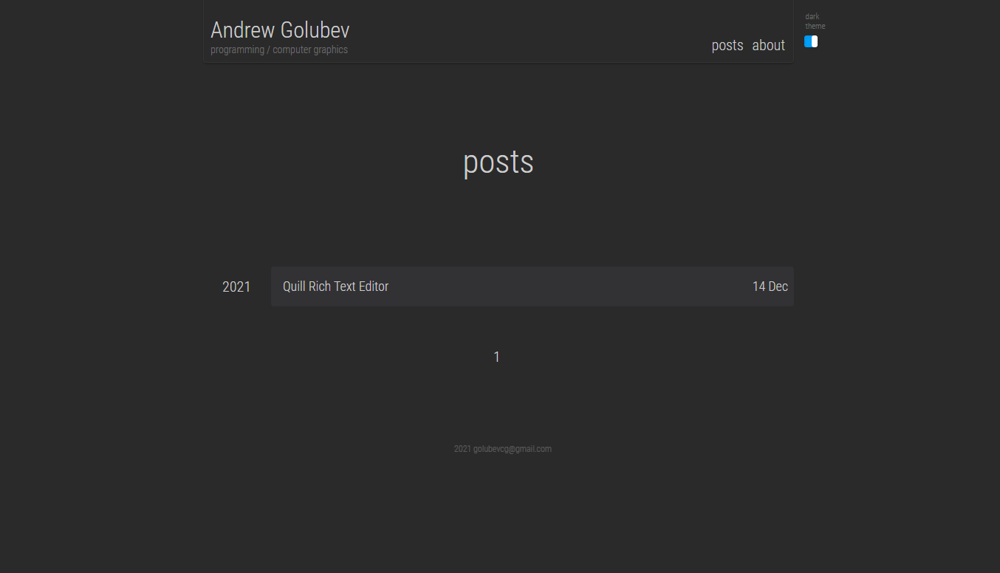

```
Developed by
Andrew Golubev
golubevcg@gmail.com
```

List of technologies and frameworks, which were used inside the blog:
- Flask;
- Flask-Login;
- Flask-Migrate;
- Flask-WTF;
- Flask-SQLAlchemy;
- JavaScript;
- Jquery, CSS;
- Docker;
- nginx;
- uWSGI;
- PostgreSQL;
- Quill.

Simple blog site with Flask and Postgres, 
all wrapped in docker container.

To launch use:\
docker-compose build flask_blog_prod \
docker-compose up flask_blog_prod \
or (docker-compose run -d -p 80:80 flask_blog_prod)

application will launch on http://127.0.0.1:5080/ 

main page view:

